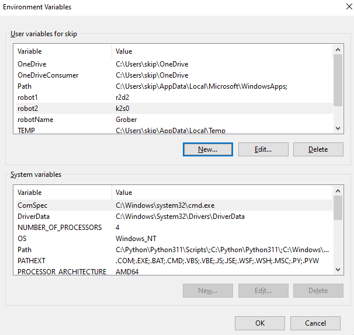

There are two settings files in this ".vscode" directory, which is where we configure the workspace. These files are tracked by github, so they have to be kept such that they should work on any of our computers.  

settings.json holds the workspace settings. The most important lines in it hides certain files from the project explorer in VS Code. This simplifies the view for the team members so they will only see the files they need. To do that, we hide the files and folders listed at the top of the file.  

Most team members will not need to make any changes to the settings.json file. Hidden files can still be edited by using ctrl-o to show the "Open File" dialog.  

tasks.json holds the settings for vscode tasks, which is how vscode can run shell programs. There are two types of tasks configured here. The first one is to upload and run the current file. For this to work, a user environment variable will need to be set to define the robot name. The variable name will be `robotName` and the value should be the robot name. The second task auto-runs a `git pull` each time the local folder is opened in VS Code.

